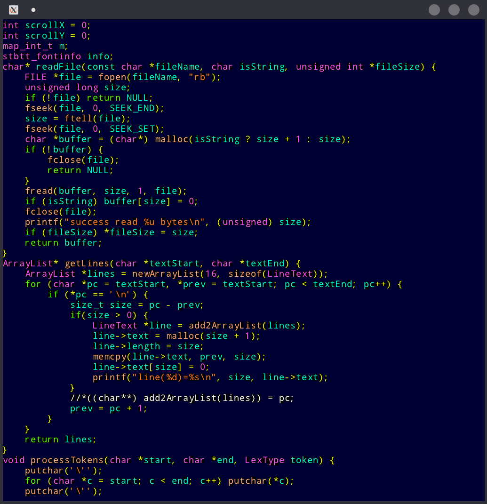

Very simple parser and renderer with syntax highligtning for C-like langs. Read text file, open X11 window and allow to scroll up and down using keyboard arrows. Press ESC to exit. Tested only in Linux, made for education purpose. Has a small amount of dependencies, all included in source files, compile to super tiny binary file (62 kb for amd64).

